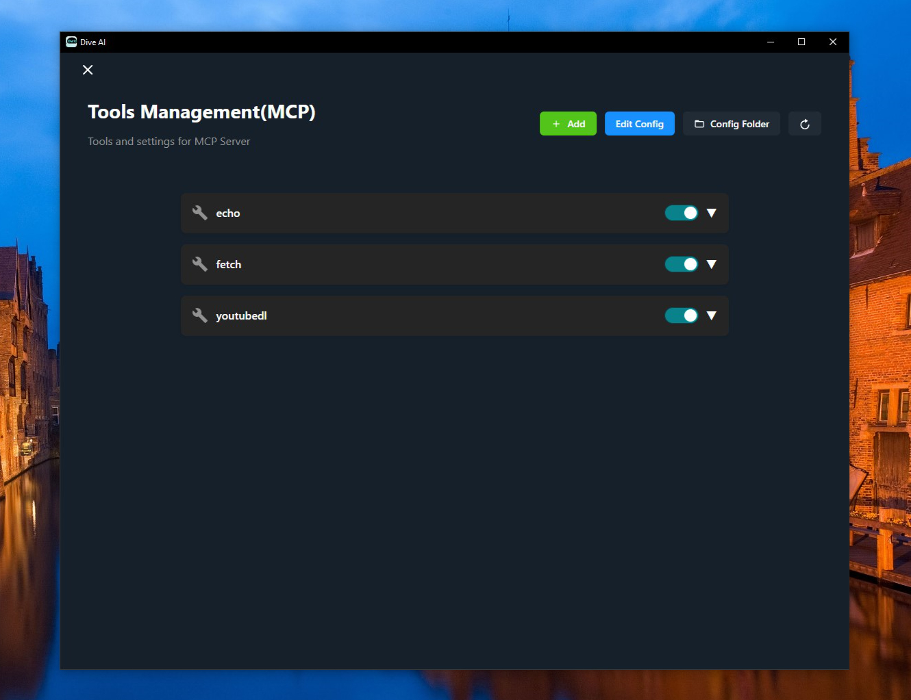

# Souls Agent 🤿 🤖


[](https://discord.com/invite/qceMERf4y2)
[](https://twitter.com/Souls_ai_agent)

Souls is an open-source MCP Host Desktop Application that seamlessly integrates with any LLMs supporting function calling capabilities. ✨


## Features 🎯

- 🌐 **Universal LLM Support**: Compatible with ChatGPT, Anthropic, Ollama and OpenAI-compatible models
- 💻 **Cross-Platform**: Available for Windows, MacOS, and Linux
- 🔄 **Model Context Protocol**: Enabling seamless MCP AI agent integration on both stdio and SSE mode
- 🌍 **Multi-Language Support**: Traditional Chinese, Simplified Chinese, English, Spanish with more coming soon
- ⚙️ **Advanced API Management**: Multiple API keys and model switching support
- 💡 **Custom Instructions**: Personalized system prompts for tailored AI behavior
- 🔄 **Auto-Update Mechanism**: Automatically checks for and installs the latest application updates

## Recent updates(2025/3/14)

- 🌍 **Spanish Translation**: Added Spanish language support
- 🤖 **Extended Model Support**: Added Google Gemini and Mistral AI models integration

## Knowledge Base RAG Prioritization

This feature prioritizes local knowledge base content over web search results when a knowledge base is active.

### Features

1. **Dedicated Knowledge Search Tool**: When a knowledge base is active, a `knowledge_search` tool is automatically added as the highest priority tool to encourage the AI to check the knowledge base first.

2. **Web Search Enhancement**: The web search tool is wrapped to check the active knowledge base before falling back to a web search, ensuring knowledge base content is prioritized.

3. **Dynamic Tool Configuration**: Tools are automatically reconfigured when a knowledge base is activated or deactivated.

4. **System Prompting**: An extra system message is added to instruct the AI to use the knowledge base for relevant topics.

5. **Semantic Search**: Knowledge base search uses a basic semantic relevance scoring system to find the most pertinent content.

### How it Works

When you activate a knowledge base:

1. The system registers a high-priority `knowledge_search` tool
2. The system wraps the `web_search` tool to check knowledge base content first
3. The AI receives instructions to prefer the knowledge base for relevant topics
4. Search queries first check the knowledge base content before falling back to web search

This ensures that your curated local content is prioritized over generic web content when answering queries.

## Download and Install ⬇️

Get the latest version of Souls:
[](https://github.com/OpenAgentPlatform/Souls/releases/latest)

For Windows users: 🪟
- Download the .exe version
- Python and Node.js environments are pre-installed

For MacOS users: 🍎
- Download the .dmg version
- You need to install Python and Node.js (with npx uvx) environments yourself
- Follow the installation prompts to complete setup

For Linux users: 🐧
- Download the .AppImage version
- You need to install Python and Node.js (with npx uvx) environments yourself
- For Ubuntu/Debian users:
  - You may need to add `--no-sandbox` parameter
  - Or modify system settings to allow sandbox
  - Run `chmod +x` to make the AppImage executable

## MCP Tips

While the system comes with a default echo MCP Server, your LLM can access more powerful tools through MCP. Here's how to get started with two beginner-friendly tools: Fetch and Youtube-dl.




### Quick Setup

Add this JSON configuration to your Souls MCP settings to enable both tools:

```json
 "mcpServers":{
    "fetch": {
      "command": "uvx",
      "args": [
        "mcp-server-fetch",
        "--ignore-robots-txt"
      ],
      "enabled": true
    },
    "filesystem": {
      "command": "npx",
      "args": [
        "-y",
        "@modelcontextprotocol/server-filesystem",
        "/path/to/allowed/files"
      ],
      "enabled": true
    },
    "youtubedl": {
      "command": "npx",
      "args": [
        "@kevinwatt/yt-dlp-mcp"
      ],
      "enabled": true
    }
  }
```

### Using SSE Server for MCP

You can also connect to an external MCP server via SSE (Server-Sent Events). Add this configuration to your Souls MCP settings:

```json
{
  "mcpServers": {
    "MCP_SERVER_NAME": {
      "enabled": true,
      "transport": "sse",
      "url": "YOUR_SSE_SERVER_URL"
    }
  }
}
```

### Additional Setup for yt-dlp-mcp

yt-dlp-mcp requires the yt-dlp package. Install it based on your operating system:

#### Windows
```bash
winget install yt-dlp
```

#### MacOS
```bash
brew install yt-dlp
```

#### Linux
```bash
pip install yt-dlp
```

## Build 🛠️

See [BUILD.md](BUILD.md) for more details.

## Connect With Us 🌐
- 💬 Join our [Discord](https://discord.com/invite/qceMERf4y2)
- 🐦 Follow us on [Twitter/X](https://x.com/Souls_ai_agent)
- ⭐ Star us on GitHub
- 🐛 Report issues on our [Issue Tracker](https://github.com/OpenAgentPlatform/Souls/issues)


